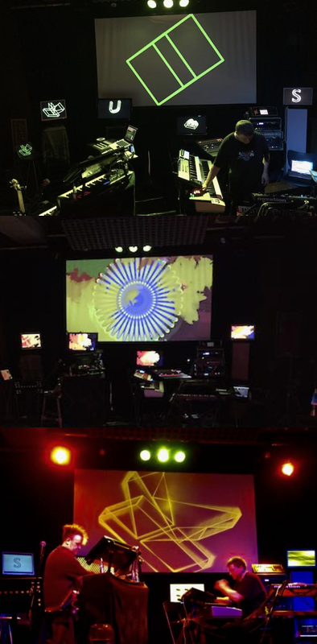

# BLINKLICHTMASCHINE

This repository contains a body of work around generating live visuals and live streaming [a band](https://only1klaus.com). We are using [QLC+](https://qlcplus.org) for DMX and Artnet control of stage lighting and video respectively. Video is generated on the fly by a custom [Vuo Pro](https://vuo.org) application. The ultimate design goal is to integrate these with [OBS](https://obsproject.com) to create a fully self-contained and remote controlled audio-visual system that can be set up to run automagically, without requiring a lighting or video operator.

We do these things not because they are hard, but because we are cheap and have no friends.

### Background

The original concept for _Blinklichtmaschine_ was demonstrated in 2015 before a small audience in Sydney's Redfern. It consisted of an app developed with [Processing](https://processing.org) running on multiple screens and controlled from an iPad running TouchOSC. The architecture of the Processing application forms the basis for the current Vuo app, described below. 

The TouchOSC controller layout allowed the user to control graphics generation in real time. It also allowed for selecting which screen to control, in any combination. This meant the user could, for example, set up a different image on each screen, then select all screens and control the transformations of those images in a coordinated way. In the top left photo each screen is displaying a different 3d letter object, but they would also respond to colour and animation speed changes simultaneously, creating a powerful visual effect.

The ambition at the time was to have the Processing app running on multiple Raspberry Pis which were affordable, could be attached to the back of their respective display devices, and receive control data via their built in wifi. Having a standard video output on the Pi as well as HDMI meant the display could be anything from an old CRT to an LCD monitor or video projector. For several reasons (time, budget, etc) in the show pictured we actually used several Mac laptops of varying vintage set around the stage, as well as the in-house video projector.

Then the Processing project changed their video rendering subsystem, and among other things it became harder to create a cross-platform app, limiting our options (or more precisely, creating a whole lot more work that needed doing) and for this and other reasons (including being unable to get Ableton Live to output OSC reliably) the project fell by the wayside for a few years.

### v2

Enter Vuo. Although (for now) it's a Mac-only application, it comes with a lot of built in functionality that we previously had to code 'by hand' in Processing. In fact it only took a few hours with Vuo to put together something very similar to our original Processing app.

Meanwhile we had built up a small collection of affordable (i.e. very cheap) DMX lighting fixtures from eBay sales. It seemed reasonable to want to integrate the lights with the video, and Vuo's built-in ability to use [ArtNet](https://en.wikipedia.org/wiki/Art-Net) (a network protocol derived from, and commonly used with, the original [DMX protocol](https://en.wikipedia.org/wiki/DMX512)) was one of the key factors in deciding to resurrect work on _Blinklichtmaschine._

### Design Goals

- Robustness under pressure of live performance, especially in situations where networks can be unreliable. (For example we found that ArtNet works well over UDP, but OSC much less so.)
- Flexibility. Every application involved should be able to run on a different computer, enabling load-sharing and redundancy.

### Architecture

(Missing from this image, the VERY IMPORTANT PART which is the MIDI master keyboard controller that will make All The Things Happen) More in-depth details to follow.

### Known Issues & Challenges

- How best to control OBS scene switching. Options are 
  - MIDI. Effective if OBS is running on the same machine as the DAW, but it makes more sense to run the video and audio/midi components on separate machines and Apple's MIDI over TCP implentation is too unreliable in our experience.
  - Remote keyboard macros (fiddly to integrate with a MIDI controller)
  - Python websockets (likely best option for OBS, but so far as we're aware it's not something available natively in most DAWs)

### Future Plans

TBD

### References

Applications:
- [QLC+](https://qlcplus.org)
- [Vuo](https://vuo.org)
- [OBS](https://obsproject.com)

Protocols:
- [DMX](https://en.wikipedia.org/wiki/DMX512)
- [ArtNet](https://en.wikipedia.org/wiki/Art-Net)
- [NDI](https://en.wikipedia.org/wiki/Network_Device_Interface)
- [MIDI](https://en.wikipedia.org/wiki/MIDI)
- [AVB](https://en.wikipedia.org/wiki/Audio_Video_Bridging)

v1:
- [Processing](https://processing.org)
- [OSC](https://en.wikipedia.org/wiki/Open_Sound_Control)

Music:
- [Kl(aüs)](https://only1klaus.bandcamp.com)

